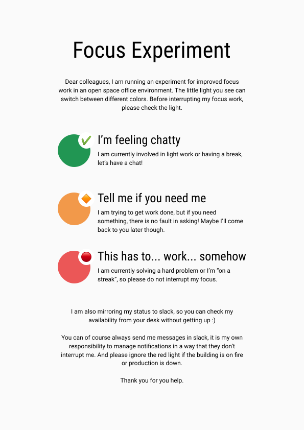

# statusled

Tiny daemon and firmware for a RGB led that shows my coworkers how focused
I currently am. 

Listens to `POST localhost:8181/status/<STATUS>` and changes the color of the
LED, posts the current status to slack, and writes it with a time stamp to
a sqlite database. That means I can later check how long I was in which stage.

I put up this little sign next to the LED:

## TODO

* [ ] restore state from SQL database on daemon boot
* [ ] detect suspends (e.g. setInterval in combination with time measurement) and store "off" into database at start of downtime
